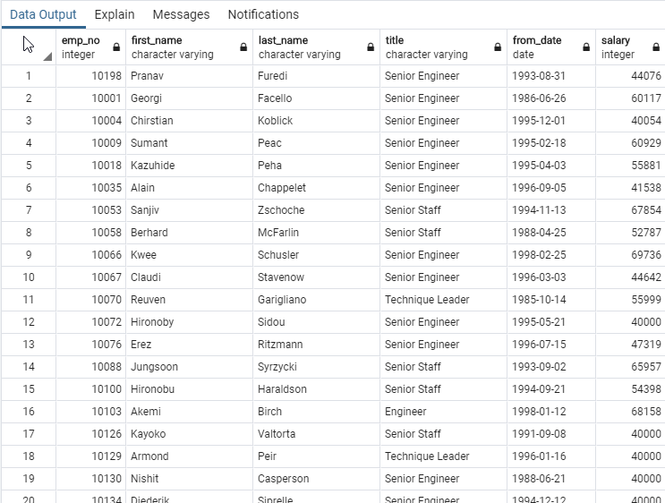
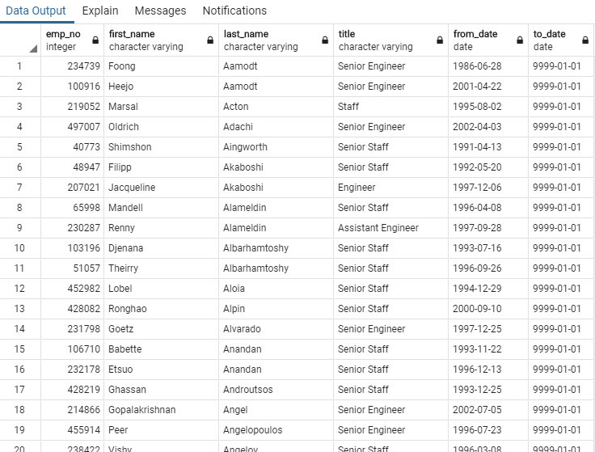

# Pewlett Hackard Analysis

### Project Summary

To create the new list of potential mentors, we need to create a query that returns a list of current employees eligible for retirement, as well as their most recent titles

1. a list of current employees eligible for retirement: "Number of titles-Retiring"
2. a list of most recent titles: "The Most Recent Titles"
3. a list of potential mentors: "Who’s Ready for a Mentor?"

___

### ERD Pewlett Hackard Employees

***Image***


***Scripts edit on [QuickDBD](https://app.quickdatabasediagrams.com)***

```
Departments
-
dept_no varchar PK
dept_name varchar

Employees
-
emp_no int PK 
birthday_date date
first_name varchar
last_name varchar
gender varchar
hire_date date

Dept_manager
-
dept_no varchar PK FK - Departments.dept_no
emp_no int PK FK - Employees.emp_no
from_date date
to_date date

Salaries
-
emp_no int PK FK - Employees.emp_no
salary int
from_date date
to_date date

Titles
-
emp_no int PK FK >- Employees.emp_no
title varchar
from_date date PK
to_date date

Dept_emp
-
emp_no int PK FK >- Employees.emp_no
dept_no varchar PK FK >- Departments.dept_no
from_date date
to_date date
```
***SQL Scripts to create tables and relationships***

[Schema Files](Queries/DDL/schema.sql)

___

***QUESTION 1:*** A list of current employees eligible for retirement include title: "Number of titles-Retiring"

***Required Columns:*** 

- Employee number
- First and last name
- Title
- from_date
- Salary

***Plan To Queries:***

***ERD-Explore Plan***


***Plan to execute with SQL***

- Need to inner join to tables: Employees, Titles, Salaries
- Find poeple were born between 1952-01-01 AND 1955-12-31
- And hired date between 1985-01-01 AND 1988-12-31
- And current employee so the title to_date is 9999-01-01
- Select Columns:
1- Employee Number from Employees
2- First Name from Employees
3- Last Name from Employees
4- Title from Titles
5- From Date from Titles
6- Salary from Salaries
- Create all_titles_retiring table 

```
SELECT 
	e.emp_no, e.first_name, e.last_name, t.title, t.from_date, s.salary
INTO all_titles_retiring
FROM
	public.employees as e 
	INNER JOIN public.titles as t ON e.emp_no = t.emp_no 
	INNER JOIN public.salaries as s ON e.emp_no = s.emp_no
WHERE 
	(e.birth_date BETWEEN '1952-01-01' AND '1955-12-31')
	AND (e.hire_date BETWEEN '1985-01-01' AND '1988-12-31')
	AND (t.to_date = '9999-01-01');  
```

***Image Top 20 all_titles_retiring rows***



***Total Results: 33118 rows*** 
___

***QUESTION 2:*** A list of most recent titles of the retirings: "The Most Recent Titles"

***Required Columns:*** 

- Title
- Count


***Plan To Queries:***

***Using all_titles_retiring table to answer***

- All retiring employees are currently holding a title in the company
- Just need to group and count titles 
- Order by title
- Create title_counts table

```
SELECT 
	title, COUNT(Title) 
INTO title_counts
FROM
	all_titles_retiring
GROUP BY 
	title
ORDER BY 
	title;
```

***Image title_count rows***


***Total Results: 7 rows*** 

***NOTE:*** We can use an alternative way to solve this issue if we think a person can have multiple titles. The result are still the same.
```
-- Create a Common Table Expressions: is a temporary table during execute SQL expressions 
-- Row_Number() is increased for each data row execute, however it can  be increased 
-- 	or reset back over the Partition data
-- Partition data is grouping data in the similar information and oragnized by particular data order
-- so that Row_Number() can be increased in the same group data rows 
-- 	and reset back value when the new group data is next
-- Order_Number keeps Row_number() in the each partition
WITH titles_retiring AS(
SELECT 
	emp_no, first_name, last_name, title, from_date, salary, 
	Row_Number() Over (Partition By emp_no ORDER BY from_date DESC) AS Order_Number 
FROM 
	public.all_titles_retiring
)
-- Each employee may have many different job titles in the career. 
-- Order_Number are used to indicate many job titles. 
-- It is running from 1(one) to many where 1(one) is the most recent job title.
-- Count titles where the Order_Number = 1 (recent title) 
-- Group by title and order in alphabet order
SELECT 
	title, COUNT(Title) 
INTO title_counts
FROM
	titles_retiring
WHERE 
	Order_Number = 1
GROUP BY 
	title
ORDER BY 
	title;
-- 7 rows
```

___

***Question 3*** A list of potential mentors who can be promoted or step-up : "Who’s Ready for a Mentor?"

***Required Columns:*** 

- Employee number
- First name 
- Last name
- Title
- From date 
- To date

***Plan To Queries:***

***ERD-Explore Plan***


***Plan to execute with SQL***

- Need to inner join to tables: Employees, Titles
- Find poeple were born between 1965-01-01 AND 1965-12-31
- And current employee so the title to_date is 9999-01-01
- Order by Last name and First name
- Select Columns:
1- Employee Number from Employees
2- First Name from Employees
3- Last Name from Employees
4- Title from Titles
5- From Date from Titles
6- To date from Titles
- Create ready_become_mentors table 

```
SELECT 
	e.emp_no, e.first_name, e.last_name, t.title, t.from_date, t.to_date
INTO ready_become_mentors
FROM
	public.employees AS e
	INNER JOIN public.titles AS t on e.emp_no = t.emp_no
WHERE 
	e.birth_date BETWEEN '1965-01-01' AND '1965-12-31'
	AND t.to_date = '9999-01-01'
ORDER BY 
	e.last_name, e.first_name;
```

***Image Top 20 ready_become_mentors rows***



***Total Results: 1549 rows*** 
___

***Summary***: Let put the retiring titles and mentoring titles of current employees in the same view

***Plan To Queries:***

- Titles
- Retiring Titles
- Mentoring Titles

***Plan To Queries:***

***Plan to execute with SQL***
- Create a tempory common table that group and count titles of ready_become_mentors
- Let join title_counts and the temporary table
- Use LEFT JOIN for title_counts

```
With titles_mentors as (
SELECT Title, Count(Title) FROM ready_become_mentors
GROUP BY Title
Order by title
	)
Select
tr.title, tr.count as retiring_title, tm.count as mentoring_titles, tr.count - tm.count as need_hiring_titles
FROM
title_counts as tr LEFT JOIN 
titles_mentors tm ON tr.title = tm.title
Order By tr.title
```

***Image SQL Results***


***Total Results: 7 rows*** 

Conclusion:

